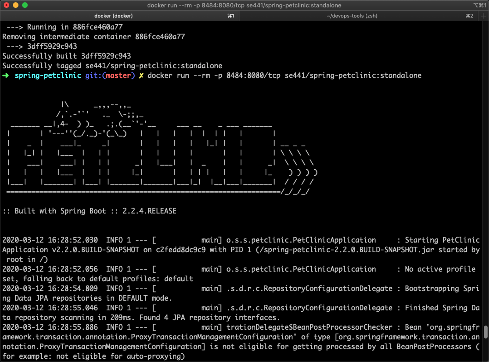
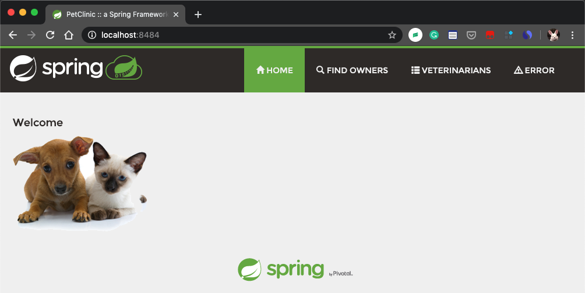
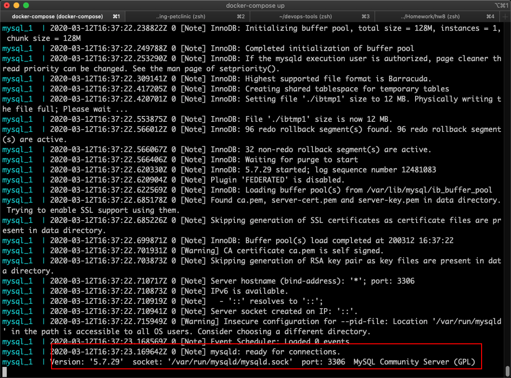
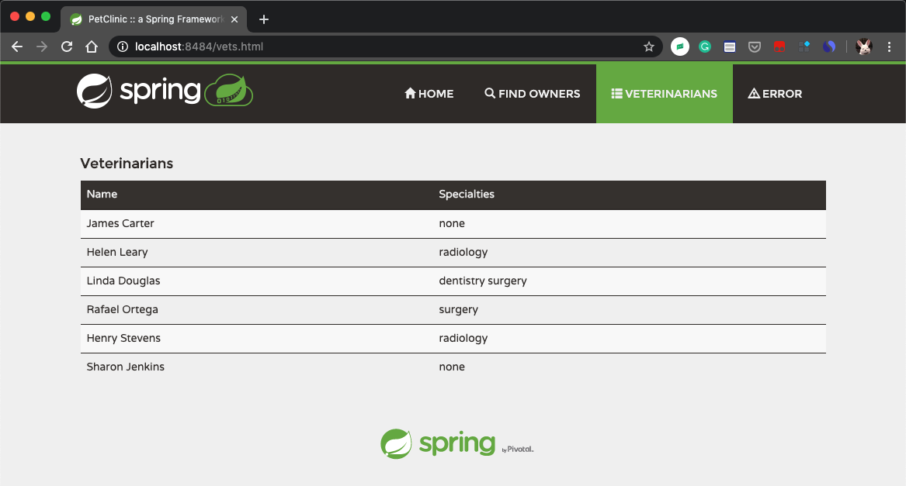
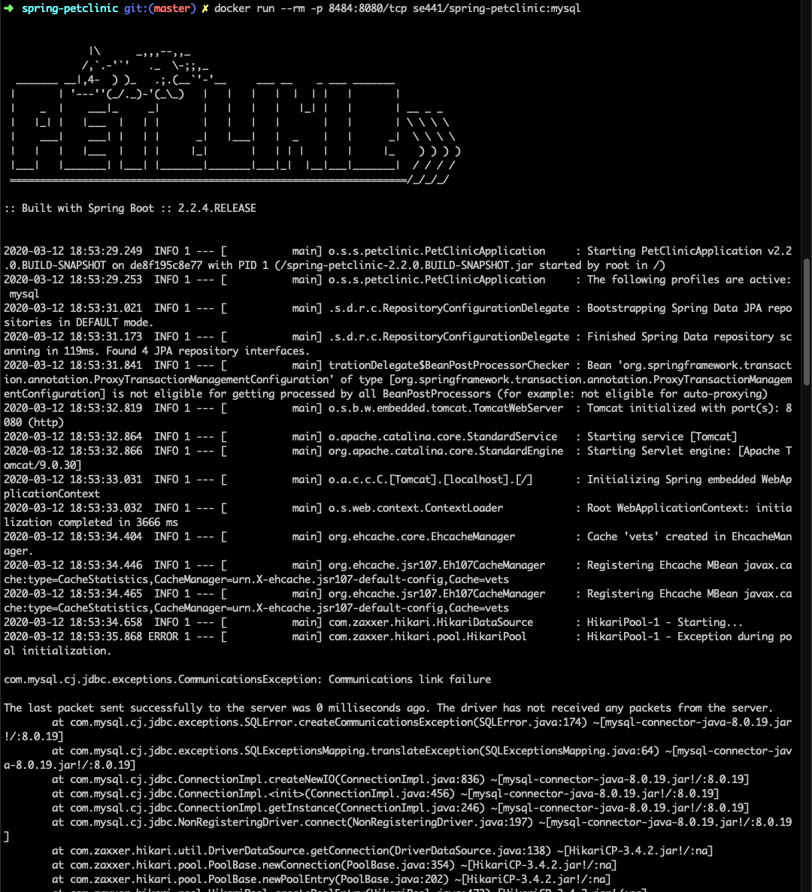
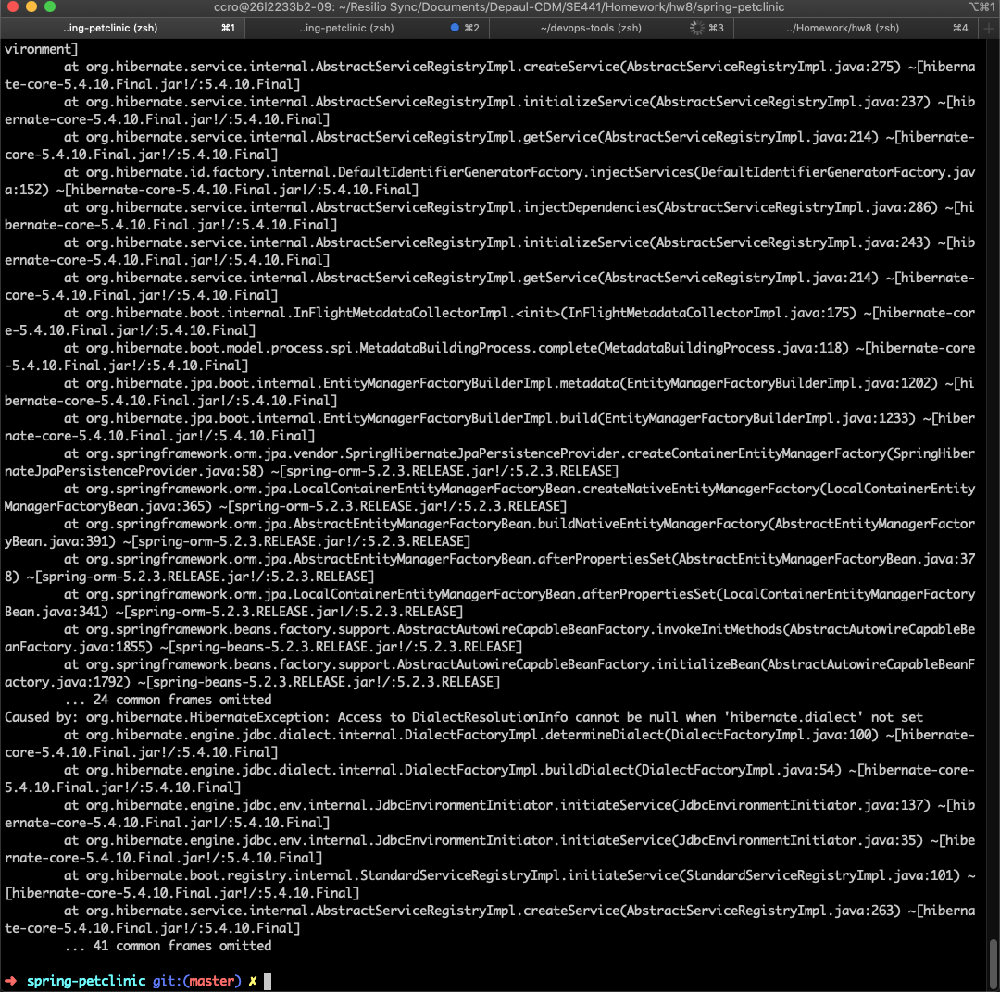
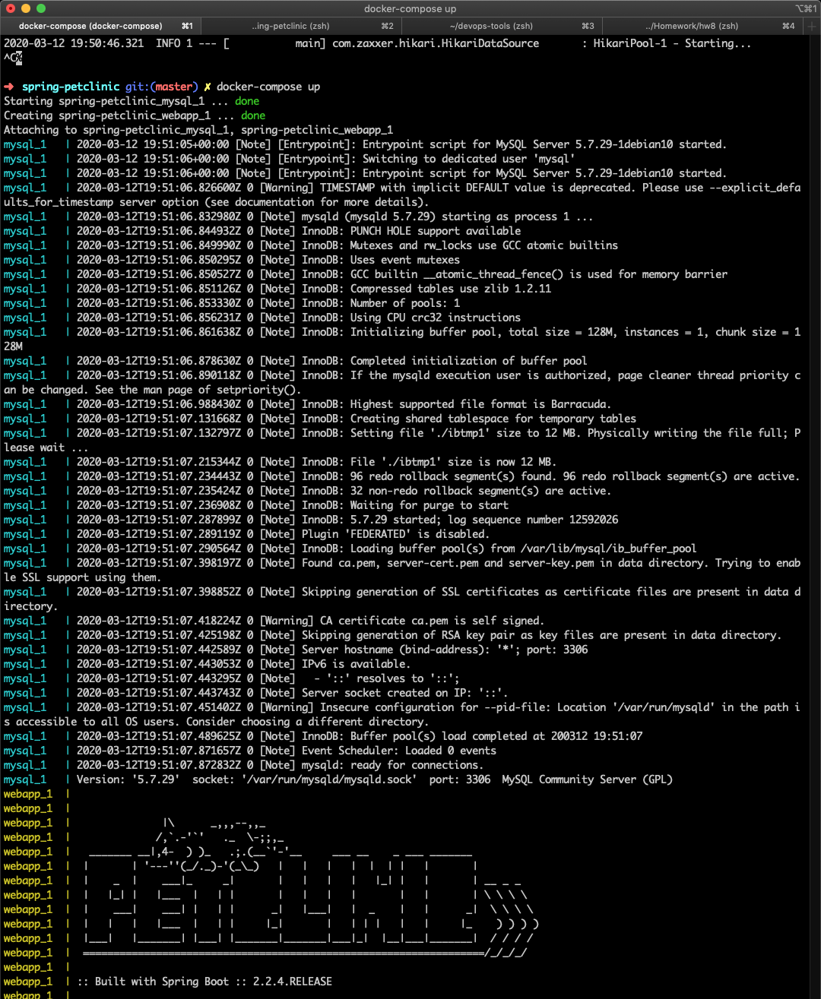
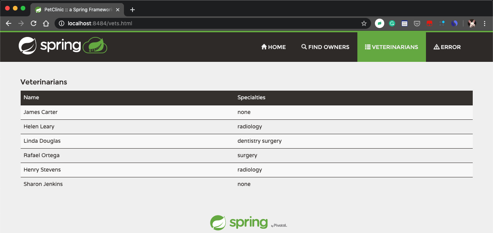

## [Homework 8] SE-441 Continuous Delivery and DevOps 
- Name: Chengcheng Luo
- Student ID: 1924540

## Deliverables [50 pts]
> For this week, please provide screen captures uploaded and embedded into the SUBMISSIONS.md file the show:

### DOCKER
1. [5 pts] Your dockerfile. Please provide a link to this file rather than a screen capture.
[Dockerfile](Dockerfile_1.1)

2. [5 pts] Your running docker instance as shown by a ps command.

3. [5 pts] Your browser accessing the main page of the website from your local container.

### DOCKER COMPOSE - MYSQL ONLY
1. [5 pts] The output from the docker-compose up command.

2. [5 pts] Your browser accessing the “Veterinarians” page of the website from your local container when you run the application from the host system.

3. [5 pts] A section of the stack trace generated when you attempt to run the application container that has been updated to use MySQL.

... ...

### DOCKER COMPOSE - APP SERVER AND MYSQL
1. [5 pts] Your updated docker-compose.yml file containing the application server, built from your local Dockerfile, and the existing MySQL configuration. Please provide a link to this file rather than a screen capture.
[docker-compose.yml](docker-compose.yml)

2. [5 pts] Your updated application-mysql.properties file containing the URL change for the database server. Please provide a link to this file rather than a screen capture.
[application-mysql.properties](src/main/resources/application-mysql.properties)

3. [5 pts] The output from the docker-compose up command.

4. [5 pts] Your browser accessing the “Veterinarians” page of the website from your local con- tainer.

